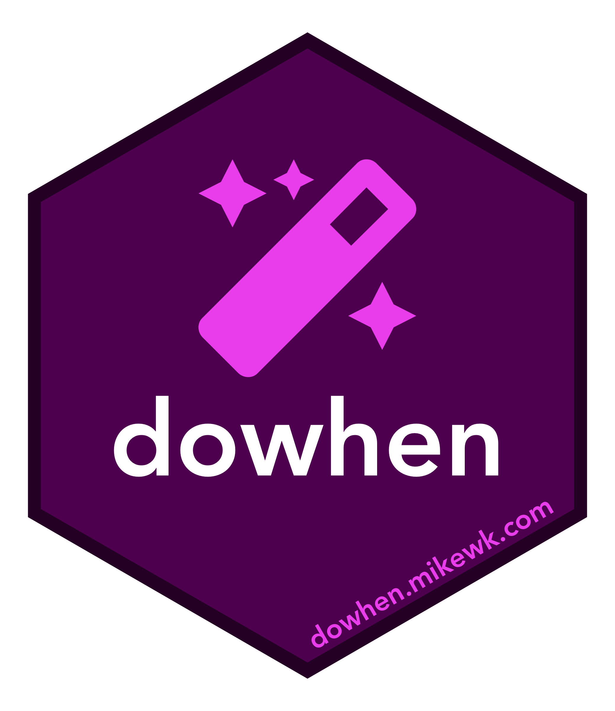

<!-- README.md is generated from README.Rmd. Please edit that file -->

# hex-stickers

A repo for my hex stickers. You can find all the [code used to create
the hex logos](code.R) as well as the [PNG](PNG) versions (eventually
I’ll fix the SVG versions).

I use these stickers for my R packages and for [my personal
website](https://mikewk.com).

## Icons

These stickers use [fontawesome](https://fontawesome.com) icons. To use
these icons on your local machine, [download a copy of the
icons](https://fontawesome.com/how-to-use/on-the-desktop/setup/getting-started)
and install the \[three\] *`.otf`* font files.

``` r
list.files("PNG") %>% 
  sprintf("<p align='center'>  </p>", .) %>%
  paste(collapse = "\n\n") %>% 
  cat(fill = TRUE)
```

<p align="center">


</p>

<p align="center">


</p>

<p align="center">


</p>

<p align="center">


</p>

<p align="center">


</p>

<p align="center">


</p>

<p align="center">


</p>

<p align="center">



</p>

<p align="center">


</p>

<p align="center">


</p>

<p align="center">


</p>

<p align="center">


</p>

<p align="center">


</p>

<p align="center">


</p>

<p align="center">


</p>

<p align="center">


</p>

<p align="center">


</p>

<p align="center">


</p>

<p align="center">


</p>

<p align="center">


</p>

<p align="center">


</p>

<p align="center">


</p>

<p align="center">


</p>

<p align="center">


</p>

<p align="center">


</p>

<p align="center">


</p>

<p align="center">


</p>

<p align="center">


</p>

<p align="center">


</p>

<p align="center">


</p>

<p align="center">


</p>

<p align="center">


</p>

<p align="center">


</p>

<p align="center">


</p>

<p align="center">


</p>

<p align="center">


</p>

<p align="center">


</p>

<p align="center">


</p>

<p align="center">


</p>

<p align="center">


</p>

<p align="center">


</p>

<p align="center">


</p>

<p align="center">


</p>

<p align="center">


</p>

<p align="center">


</p>

<p align="center">


</p>

<p align="center">


</p>

<p align="center">


</p>

<p align="center">


</p>

<p align="center">


</p>

<p align="center">


</p>
